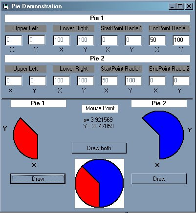

<div align="center">

## Pie Function


</div>

### Description

This is a simple program to help those unfamiliar with the API Pie Function. I built this to help me understand how this function works.
 
### More Info
 
Using the text boxes, the user can manipulate the Pie charts.


<span>             |<span>
---                |---
**Submitted On**   |2002-10-30 15:59:56
**By**             |[Emmanuel Poe](https://github.com/Planet-Source-Code/PSCIndex/blob/master/ByAuthor/emmanuel-poe.md)
**Level**          |Beginner
**User Rating**    |4.3 (13 globes from 3 users)
**Compatibility**  |VB 6\.0
**Category**       |[Windows API Call/ Explanation](https://github.com/Planet-Source-Code/PSCIndex/blob/master/ByCategory/windows-api-call-explanation__1-39.md)
**World**          |[Visual Basic](https://github.com/Planet-Source-Code/PSCIndex/blob/master/ByWorld/visual-basic.md)
**Archive File**   |[Pie\_Functi1492161152002\.zip](https://github.com/Planet-Source-Code/emmanuel-poe-pie-function__1-40421/archive/master.zip)

### API Declarations

```
Private Declare Function Pie Lib "gdi32" (ByVal hdc As Long, ByVal x1 As Long, ByVal Y1 As Long, ByVal x2 As Long, ByVal Y2 As Long, ByVal x3 As Long, ByVal Y3 As Long, ByVal x4 As Long, ByVal Y4 As Long) As Long
```


